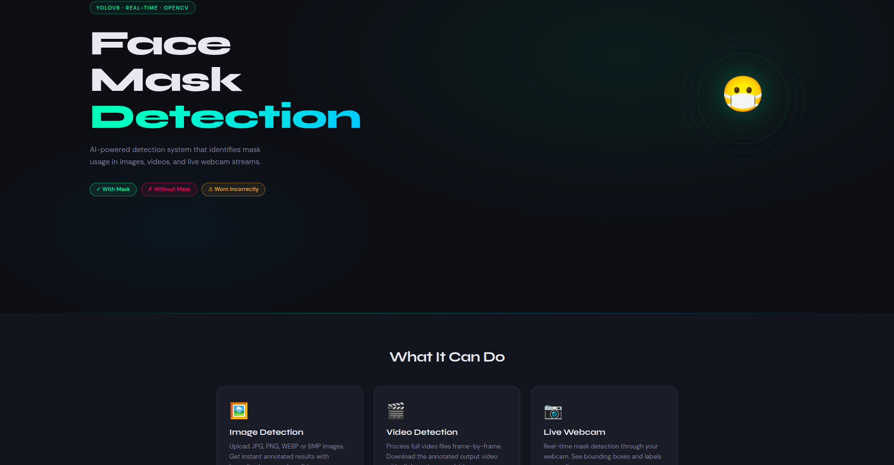
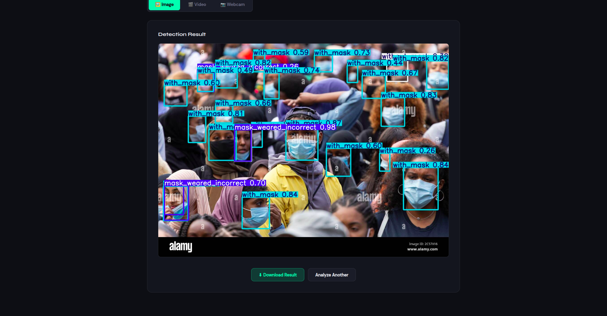

# 🎭 FACEMASK: Real-Time Face Mask Detection & Monitoring System

FACEMASK is an advanced, real-time surveillance and detection system designed to monitor face mask compliance using Artificial Intelligence and Computer Vision. By leveraging state-of-the-art deep learning and an interactive web dashboard, FACEMASK provides early detection, precise compliance categorization, and rapid stream monitoring to support public safety.

---

## 📸 Screenshots

| Hero Page | Image Detection |
|-----------|----------------|
|  |  |

---

## 🚀 Key Features

* **Real-Time AI Detection**: Utilizes YOLOv8 (Deep Learning) to classify face mask compliance into three distinct states (`with_mask`, `without_mask`, `mask_weared_incorrect`) with high precision.
* **Multi-Source Processing**: Processes static image uploads, full-length video files, and live webcam feeds.
* **Interactive Control Dashboard**: A Flask-powered web interface featuring:
  * **Live Webcam Stream**: Real-time video processing using OpenCV and YOLOv8.
  * **Upload Panels**: Support for processing images and videos.
  * **Quick Download Action**: Instantly download processed media directly from the browser.
* **Compliance Statistics**: Visual indicator states showing the classification labels and color-coded boundaries.

---

## 🛠️ Technology Stack

### Backend
* **Language**: Python 3.9+
* **ML Framework**: YOLOv8 (Ultralytics), PyTorch
* **Computer Vision**: OpenCV
* **Web Framework**: Flask


### Frontend
* **Structure**: HTML5 (Semantic elements)
* **Styling**: CSS3 (Custom dashboard layout)
* **Scripting**: JavaScript (ES6+)

---

## 🏷️ Detection Classes

The YOLOv8 model (`model/best.pt`) is trained to detect the following three classes (configured in `data.yaml`):

| Class ID | Class Name | Description |
|----------|------------|-------------|
| `0` | `mask_weared_incorrect` | Mask worn incorrectly (nose/mouth exposed) |
| `1` | `with_mask` | Mask worn correctly |
| `2` | `without_mask` | No mask worn |

---

## 📦 Installation & Setup

### Data Sets
* **Recommended Kaggle Dataset**: [Face Mask Detection Dataset](https://www.kaggle.com/datasets/andrewmvd/face-mask-detection) for training YOLOv8 models.

### Prerequisites
* Python 3.9+
* Web Browser (Chrome, Firefox, Safari, Edge, etc.)
* NVIDIA GPU (Optional, for optimized AI inference speed)

### Setup Steps
1. **Clone the repository**:
   ```bash
   git clone https://github.com/sahityapatell/FaceMaskDetection.git
   cd FaceMaskDetection
   ```
2. **Create and activate a virtual environment**:
   ```bash
   python -m venv venv
   source venv/bin/activate  # Linux/macOS
   # On Windows: venv\Scripts\activate
   ```
3. **Install dependencies**:
   ```bash
   pip install -r requirements.txt
   ```
4. **Place the trained model**:
   Download your trained model weights or use the pre-trained weights, and place the file at:
   ```text
   model/best.pt
   ```
   ```text
   pretrained model is available at: https://drive.google.com/file/d/19hGNgffmV2edri_74WZNMT6gT5nht2aO/view?usp=drive_link
   ```
5. **Start the detection server**:
     ```bash
     python app.py
     ```
   Open [http://127.0.0.1:5000](http://127.0.0.1:5000) in your web browser.

---

## 🏋️ Training Your Own Model

If you want to train the model from scratch on your own dataset:
1. Organize your dataset folders(read README.txt in dataset folder) in YOLO format:
   ```text
   dataset/
       ├── images/
   │   ├── train/
   │   └── val/
       └── labels/
       ├── train/
       └── val/
   ```
2. Ensure your dataset path is correctly configured in `data.yaml`.
3. Run the training script:
   ```bash
   python train_yolo.py
   ```
4. The best weights are automatically copied to `model/best.pt` upon training completion.

---

## 🖥️ System Architecture

* **Ingestion Layer**: Static image uploads, video file feeds, or live webcam streams are captured.
* **Inference Layer**: YOLOv8 model processes frames to identify faces and determine mask compliance.
* **API & Logic Layer**: Flask backend serves detection logic, video streams, and handles output management.
* **Presentation Layer**: Single-page HTML dashboard visualizes the input and outputs for client consumption.

---

## 📁 Folder Structure

```text
FaceMaskDetection/
│
├── app.py                  # Flask backend (all routes)
├── train_yolo.py           # YOLOv8 training script
├── data.yaml               # Dataset config for YOLO training
├── requirements.txt
├── README.md
├── .gitignore
│
├── model/
│   └── best.pt             # Trained YOLOv8 weights (not in git)
│
├── templates/
│   └── index.html          # Single-page frontend
│
├── static/
│   ├── css/style.css
│   ├── js/script.js
│   ├── uploads/            # Temp input files
│   ├── outputs/            # Processed results
│   └── screenshots/
│
└── dataset/                # Training data (not in git)
    ├── images/train/
    ├── images/val/
    ├── labels/train/
    └── labels/val/
```

---

## 📜 License

This project is licensed under the MIT License - see the [LICENSE](LICENSE) file for details.

Developed by [@sahityapatell](https://github.com/sahityapatell).
